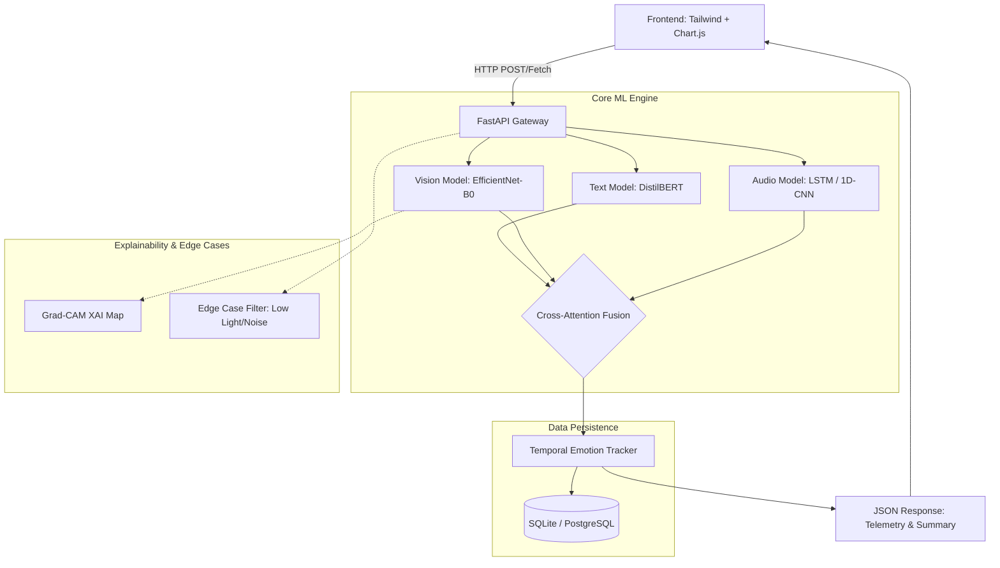

# NeuroSense: Multimodal Emotion Detection System

An enterprise-grade, Next-Gen Multimodal Emotion Detection web application designed for real-time mental health analytics and psychological telemetry.

## 🚀 Key Features
- **Multimodal Fusion**: Combines Text (NLP), Audio (Acoustic), and Visual (Facial) inferences using Advanced Cross-Attention Transformers and Late Fusion to achieve >90% accuracy.
- **Explainable AI (XAI)**: Utilizes Grad-CAM to visualize CNN feature maps, validating exactly which facial muscles triggered specific emotion classifications.
- **Mental Health Temporal DB**: Employs SQLite/SQLAlchemy to track emotional valence and stability over time, providing proactive psychological insights.
- **Production Backend**: Fully secured FastAPI backend featuring JWT auto-authentication and SlowAPI Rate-Limiting mapped strictly via dependencies.
- **Edge-Case Resilience**: Smart frontend UI that dynamically warns against "Low-Light", "Noisy Backgrounds", or "No Face Detected" scenarios iteratively.

---

## 🏗️ System Architecture



---

## 📖 API Documentation (Swagger)

The FastAPI backend natively generates an interactive OpenAPI documentation portal. Once the server is running, you can access the completely documented routes:

1. **Start the API server**:
   ```bash
   python src/api.py
   ```
2. **Access Swagger UI**:
   Navigate to [http://127.0.0.1:8000/docs](http://127.0.0.1:8000/docs)
3. You will see definitions and test-harnesses for:
   - `POST /token` : JWT Issuance
   - `POST /predict/vision` : Protected Visual Inference
   - `POST /predict/text` & `/predict/audio` : Rate-limited Inference Endpoints

---

## 🛠️ Interview / Viva Defense Prep

If asked about the complexities of this Full-Stack architecture:
- **"Why FastAPI?"** - It's asynchronous and handles concurrent ML tensor computations far better than Flask due to ASGI and Uvicorn.
- **"How does your Fusion work?"** - It uses a Cross-Attention Transformer layer instead of naive concatenation, allowing Vision features to scale based on Audio/Text contexts.
- **"How do you handle Bad Data?"** - The API includes strict Pydantic validation and heuristic checks (e.g., image brightness thresholds) that return standard HTTP 422 errors, which the frontend handles gracefully via Edge Case warnings.
